#D01_Linux
#Задание 1 Установка ОС
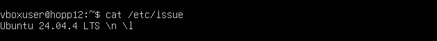
#Задание 2 Создание пользователя (пояснение по пропущенной в скриншоте команде - sudo adduser linus_torvalds) 

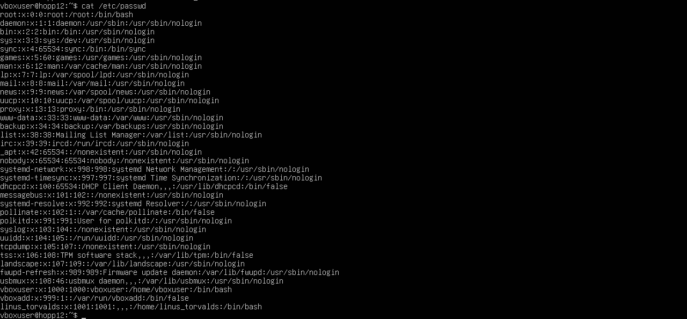
#Задание 3 Настройка сети ОС
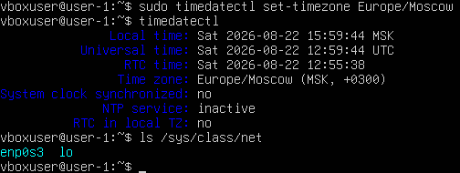
Пояснение по lo (loopback). Loopback - интерфейс внутренний, виртуальный, сетевой (эмулятор сетевой карты); ip адрес - 127.0.0.1. Loopback используется хостом для отправки сетевого трафика самому себе.
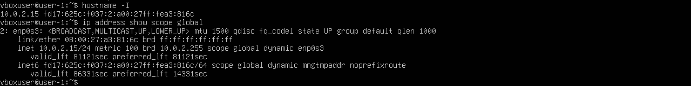
DHCP - Dynamic host configuration protocol (протокол динамической конфигурации узла) - это протокол прикладного уровня, работающий поверх UDP (User Datagram Protocol - протокол передачи датаграмм пользователя - независимых пакетов данных от пользователя - напрямую из сервера), который автоматически выдаёт устройствам в сети IP-адрес и сопутствующие параметры — маску подсети, шлюз, DNS. Работает это через четырёхэтапный обмен сообщениями между клиентом и сервером: Discover (открытие), Offer (предложение), Request (запрос), Ack (от Acknowledgement - подтверждение) (сокращённо DORA). Адрес выдаётся не навсегда, а на определённый срок — аренду (lease), которую клиент должен периодически продлевать.
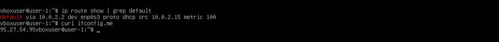
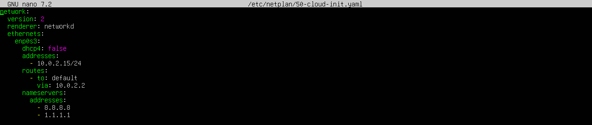
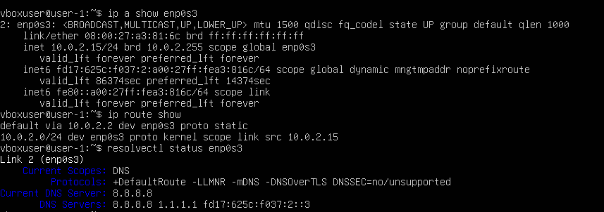
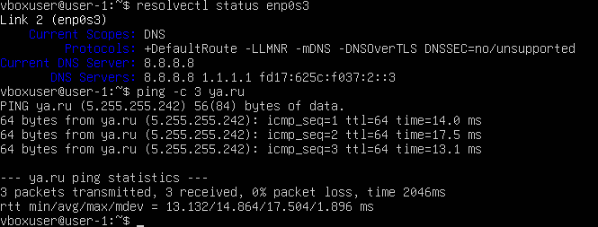
#Задание 4

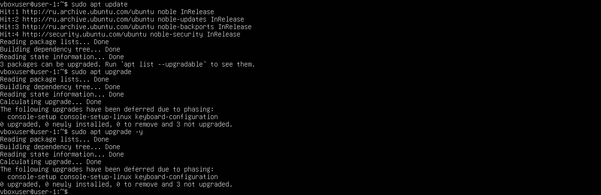
#Задание 5
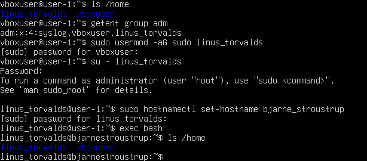
sudo (аббревиатура от superuser do) — это системная утилита в Unix-подобных ОС (Linux, macOS), которая позволяет обычным пользователям временно выполнять команды от имени суперпользователя (root) или другого пользователя. Нужна при: 
- проверке прав, когда она сверяет запрос пользователя с файлом конфигурации /etc/sudoers, чтобы убедиться, что ему разрешено это действие;
- аутентификации, когда идёт запрос пароля текущего пользователя (а не пароль root) с подтверждением его личности;
- логировании, то есть при фиксировании в системном журнале факт совершённого действия - кто, когда и какую именно команду запустил с повышенными правами (повышенные права принадлежат учетной записи суперпользователя (root); утилита sudo не является суперюзером, а выступает механизмом, который безопасно и временно делегирует эти права обычному пользователю для выполнения конкретной команды).
Назначение.
Безопасность - пользователям не нужно знать, хранить или передавать пароль суперпользователя.
Гибкий контроль - администратор может выдавать права выборочно (например, разрешить пользователю только перезапускать службы, но не удалять файлы).
Подотчетность - в системе всегда видно конкретного человека, который внес изменения, что исключает анонимные действия под общей учетной записью root.
#Задание 6
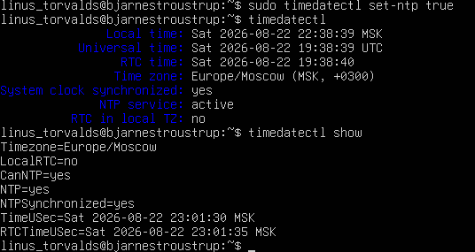
#Задание 7
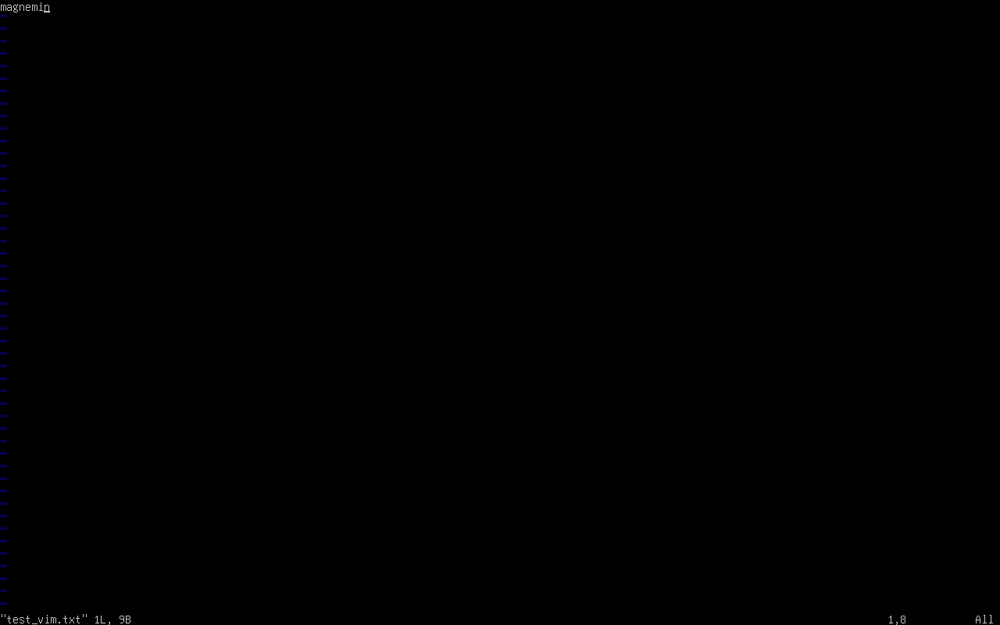
(vim: Esc + :wq)
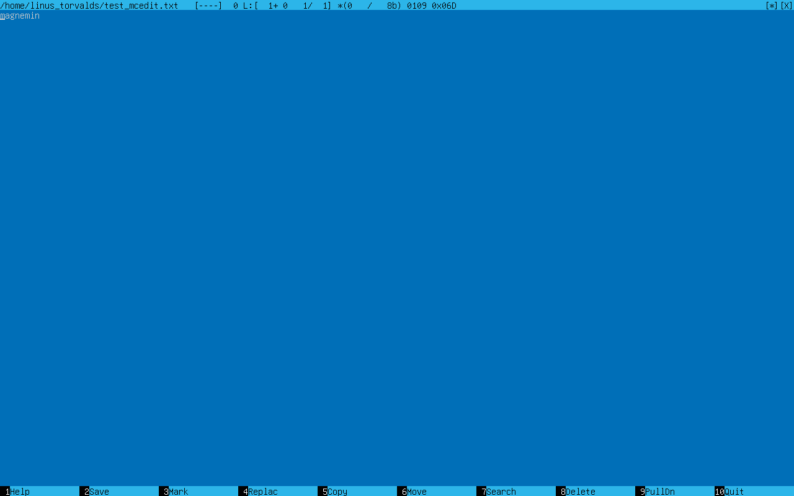
(mcedit: F2 + F10)
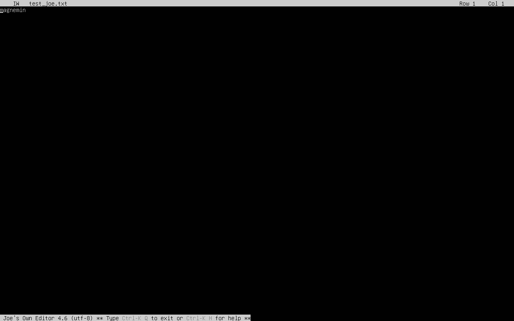
(joe: ctrl + k > x)
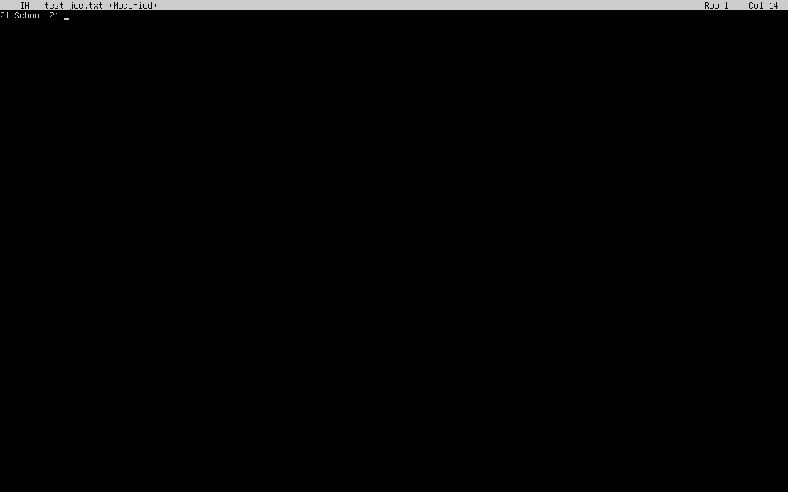
(joe: ctrl + k > q, n)

(mcedit: F10, no, enter)

(vim: esc, :q!)
#Задание 8

(vim: :s/magnemin/21 School 21 or :%s/magnemin/21 School 21, :q!)
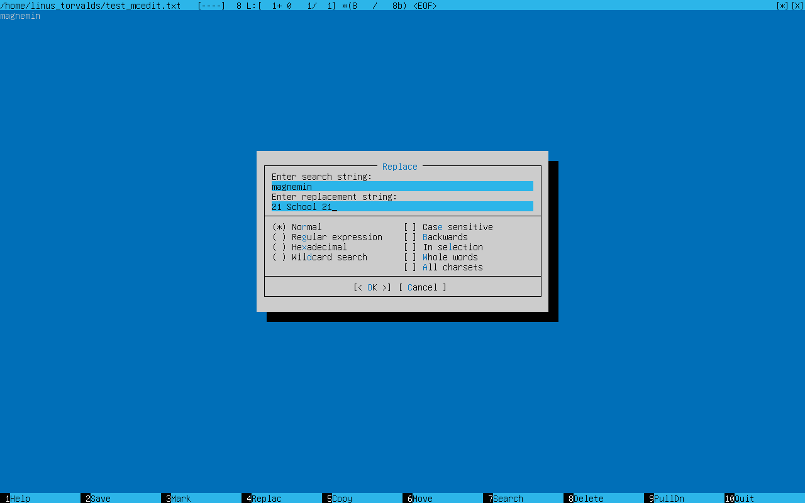
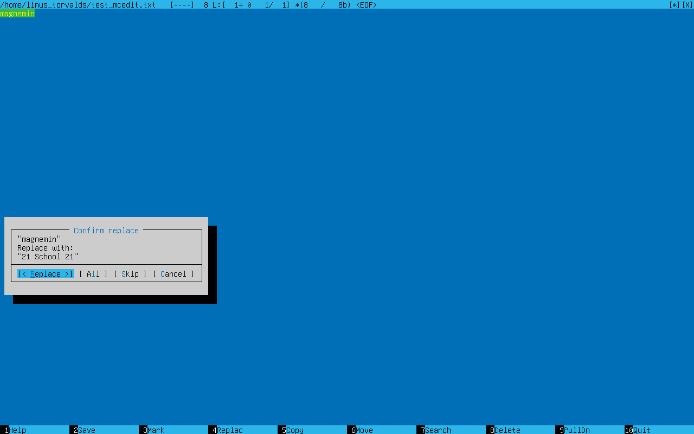

(mcedit: f4, search, replace, enter, f10, don't save)
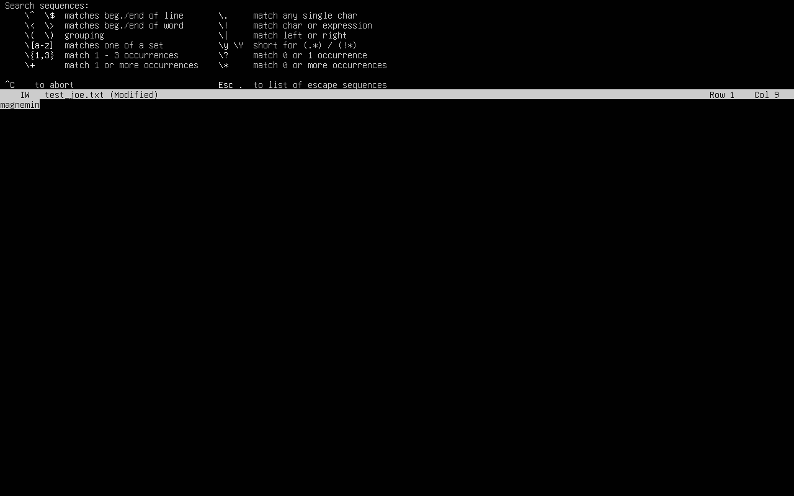
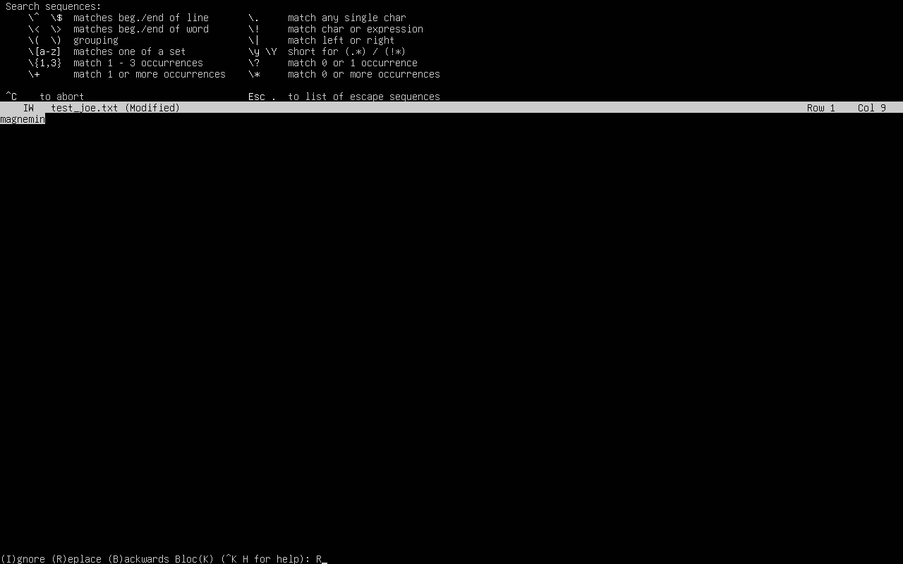
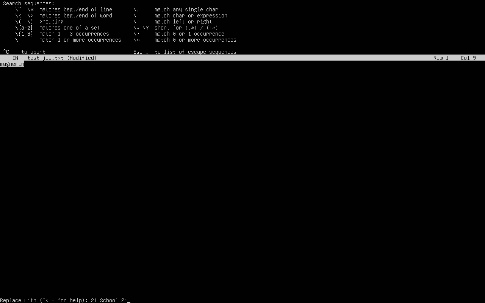
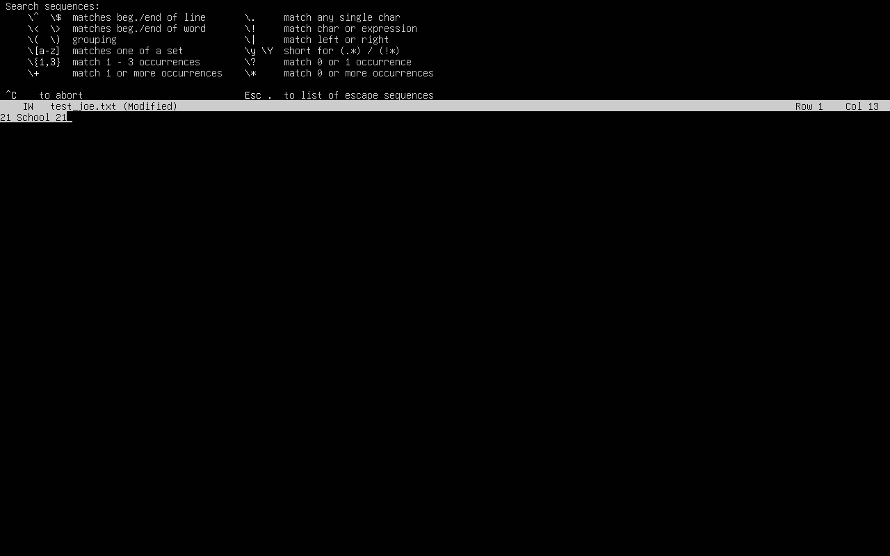
(joe ctrl+k, f, r, y, ctrl+k, q, y)
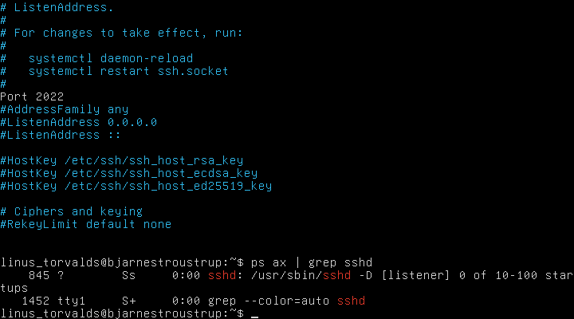
Пояснение:

1.Установка и запуск службы SSHd
Для обеспечения безопасного удалённого управления сервером была установлена служба SSHd (пакет openssh-server). 
Установка и добавление службы в автозагрузку выполнены командами:
bash
sudo apt update
sudo apt install openssh-server -y
sudo systemctl enable ssh
sudo systemctl start ssh

2.Перенастройка службы на порт 2022
В целях повышения безопасности и защиты от массового автоматического брутфорса стандартный сетевой порт был изменён с 22 на 2022. 
Правки внесены в конфигурационный файл /etc/ssh/sshd_config (директива Port 2022) [или через переопределение сокета в файле ssh.socket для Ubuntu 24.04]. После изменения конфигурации выполнен перезапуск сетевых служб:
bash
sudo systemctl daemon-reload
sudo systemctl restart ssh

3.Проверка текущего состояния процесса через утилиту ps
Для аудита запущенных процессов была применена команда ps с ключами ax (показать процессы всех пользователей, включая фоновые демоны, не привязанные к текущему терминалу):
bash
ps ax | grep sshd

В выводе зафиксирован главный процесс службы со следующими параметрами:
1. Путь к бинарному файлу: /usr/sbin/sshd -D (флаг -D указывает на запуск в фоновом режиме демона).
2. Статус процесса (STAT): Ss. Заглавная S (Interruptible sleep) означает, что процесс находится в режиме ожидания запросов без утилизации процессора; маленькая s обозначает лидера сессии.

4.Контроль сетевой активности и привязки к порту 2022
Чтобы доказать, что служба успешно перенаправлена на новый порт, была вызвана утилита просмотра сетевых сокетов:
bash
sudo ss -tunlp | grep sshd

Вывод команды подтверждает, что процесс sshd с соответствующим PID успешно слушает локальный адрес :2022 (0.0.0.0:2022).

5.Для чего нужно изменять сетевой порт?
Смена дефолтного 22-го порта на нестандартный 2022 выполнена по двум ключевым причинам.
1) Защита от автоматического сканирования (Security by Obscurity): большинство сетевых ботнетов непрерывно брутфорсят (то есть полностью перебирают пароли, ключи шифрования или логины и т.д. для взлома учётной записи или сервера) исключительно порт 22. Смена порта скрывает сервер от 99% массовых автоматических атак.
2) Оптимизация системных логов: перенос службы исключает забивание файла авторизации (/var/log/auth.log) тысячами записей о неудачных попытках входа посторонних ботов, упрощая аудит системы.
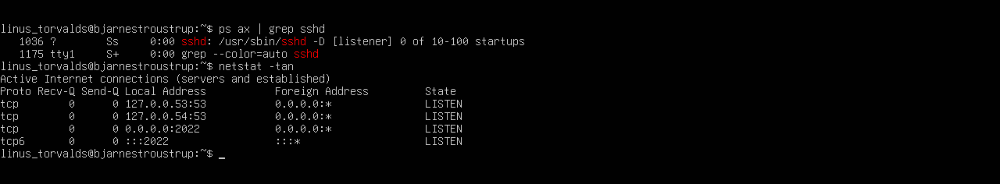
Ключи -tan:
-t = tcp = вывод только TCP - соединений.
-a = all = показ всех сокетов (активные + слушающие - listening)
-n = numeric = вывод адресов и портов цифрами, без наименований служб
Столбцы (вывод) таблицы
state — статус сокета (LISTEN — ожидает, ESTAB — обменивается данными).
Recv-Q / Send-Q — очереди получения и отправки данных (в норме равны 0) 
Local Address:Port — внутренний IP-адрес и порт вашей виртуалки 
Peer Address:Port — IP-адрес и порт удаленного устройства, которое подключилось
Значение адреса 0.0.0.0 (или *)
Означает «все сетевые интерфейсы компьютера». Служба с таким адресом слушает входящие запросы абсолютно отовсюду: через локальную петлю 127.0.0.1, через адаптер NAT (10.0.2.15) и через внешние порты хоста 
#Задание 9
uptime = 25 min
user = 1
load average - 0.00 0.00 0.00
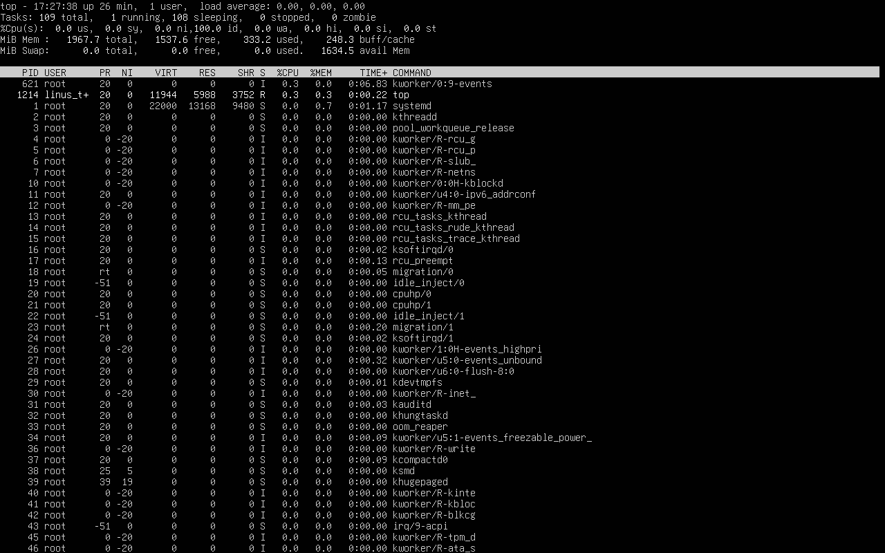
top:
tasks: 111 total, 1 running, 110 sleeping, 0 stopped, 0 zombie
%cpu(s): 0.0 us, 0.2 sy, 0.0 ni, 99.8 id, 0.0 wa, 0.0 hi, 0.0 si, 0.0 st
MiB Mem: 1967.7 total, 1471.0 free, 361.7 used, 287.3 buff/cache
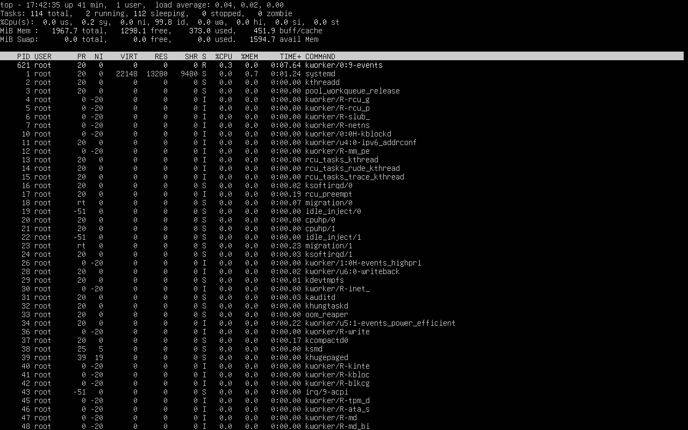 PID: 1, %mem = 0.7, time+ = 0.07.79, 
htop:
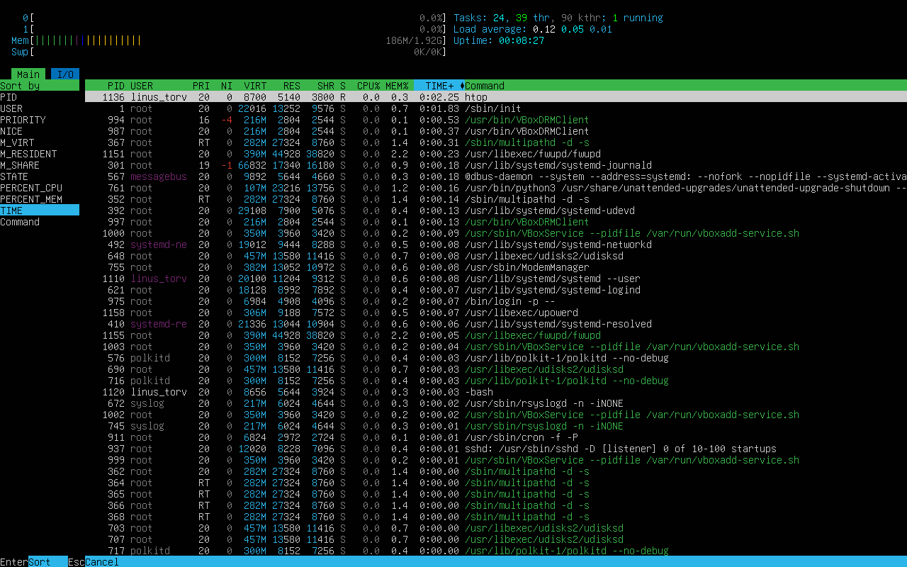 (sorted by: PID, PERCENT_CPU, PERCENT_MEM, TIME)
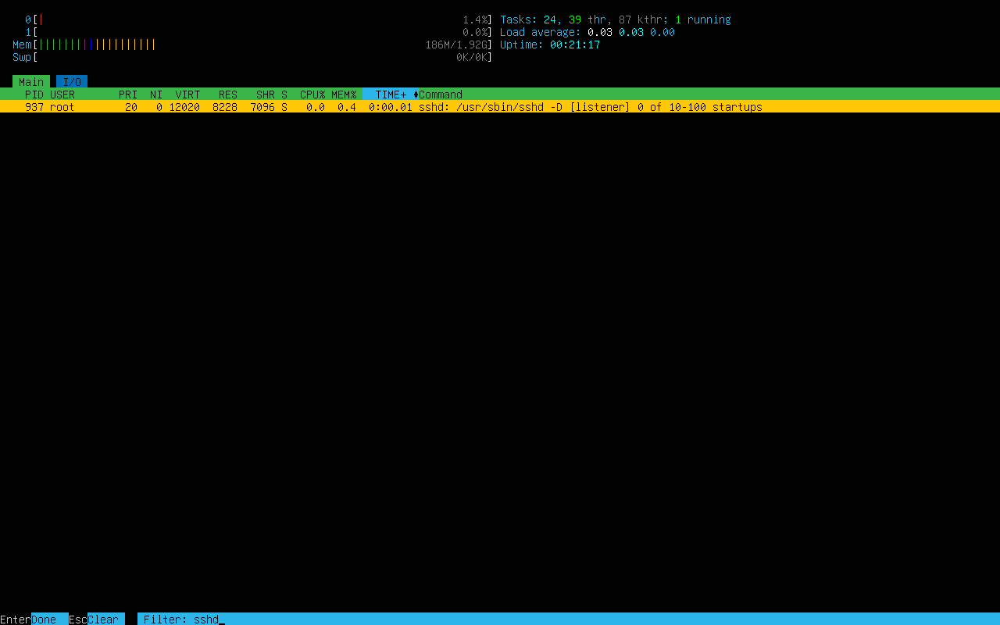 (filtered: sshd)
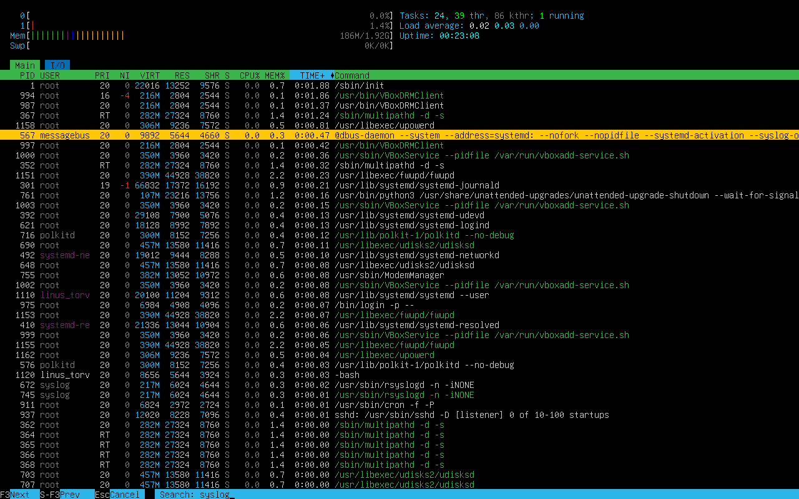 (searched: syslog)
#Задание 10
Название диска /dev/sda (ключевое - a, обозначающий первый (основной) жёсткий диск), размер: 25 Гб, секторы: 52428800 секторов. 
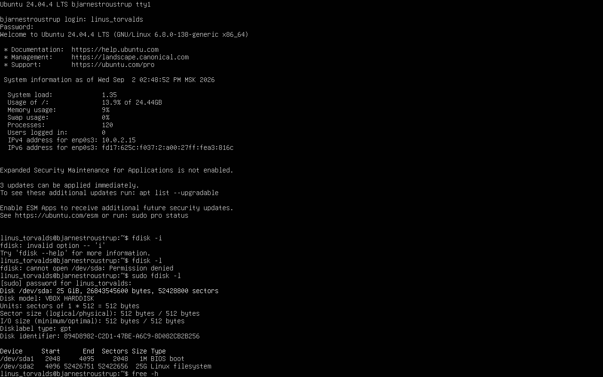 (прописана команда баланса всей оперативной памяти сервера) 
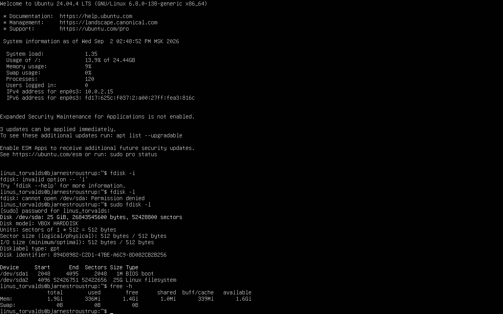 (своп: по нулям)
#Задание 11
df:
корневой раздел /; размер раздела - 25623780 Байт; размер занятого пространства - 3566960 Байт; размер свободного пространства - 20729872 Байт % использования - 15%.
df -Th:
корневой раздел /; размер - 25 Гб, used - 3,5 Гб; available - 20 Гб; Use% - 15%. file system - /dev/sda2.
#Задание 12
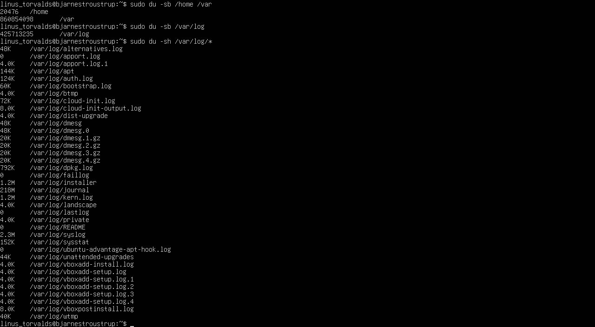
#Задание 13

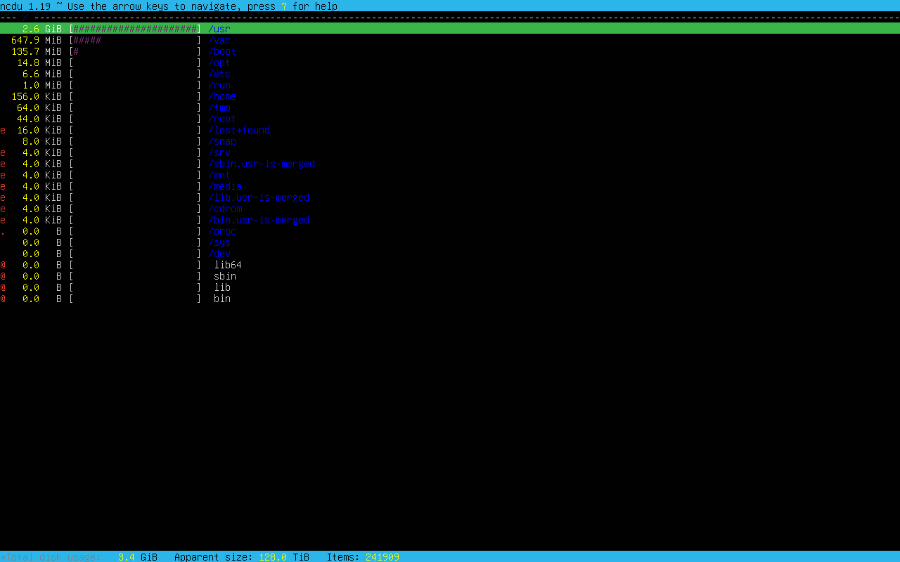
/home:
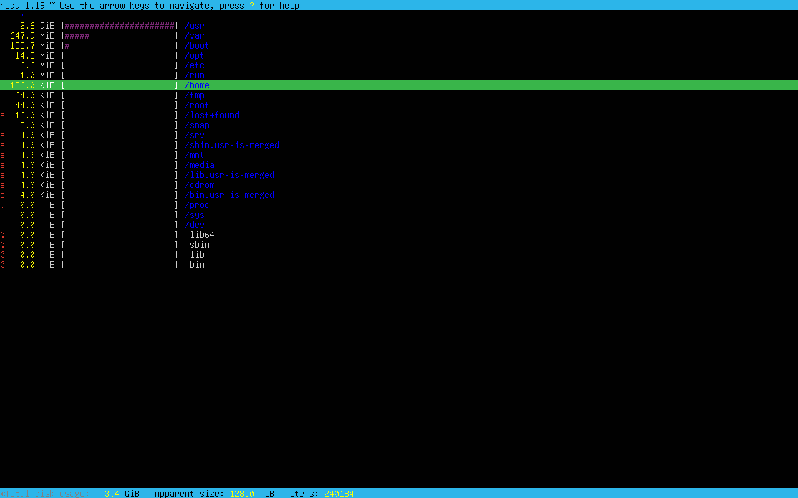
/var:
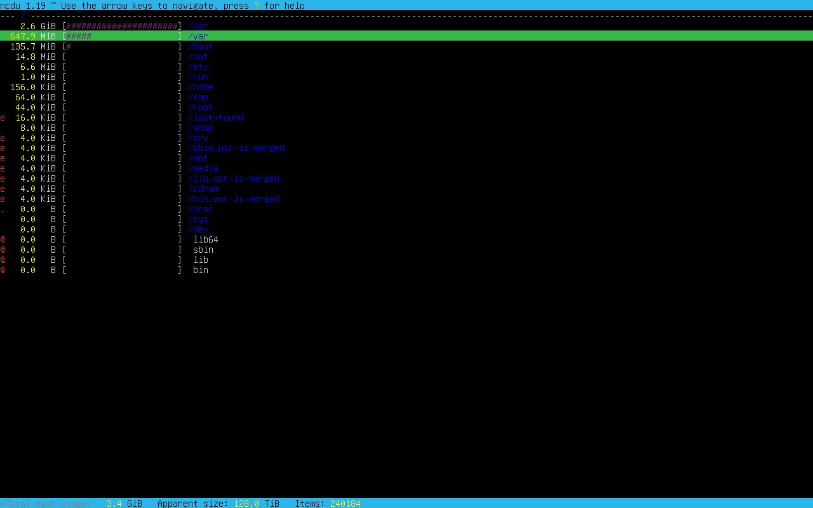
/var/log
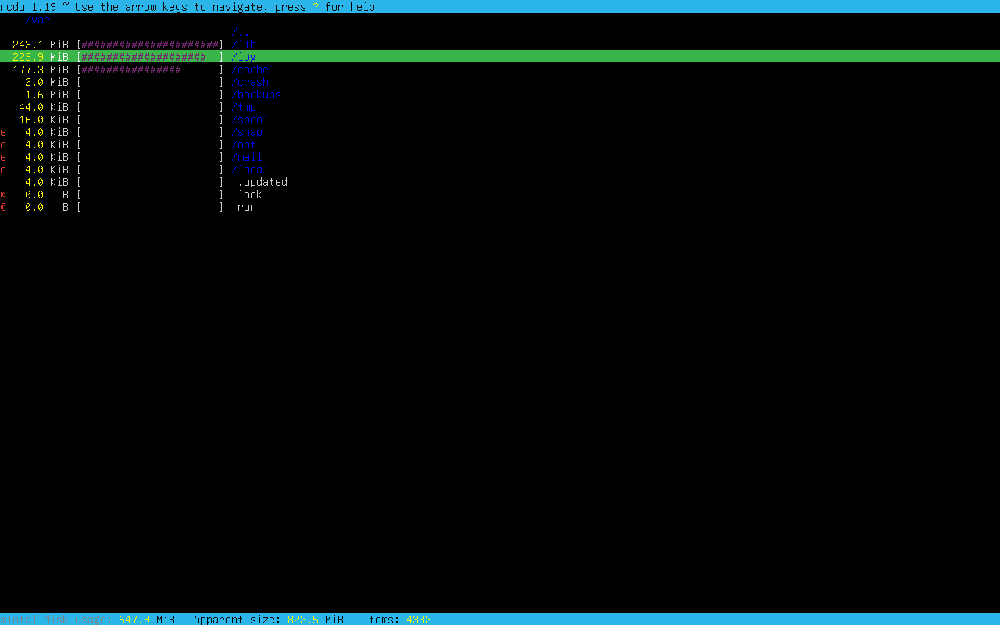
#Задание 14
2026-09-09T11:35:01.686954+03:00 bjarnestroustrup sudo: pam_unix(sudo:session): session opened for user root(uid=0) by linus_torvalds(uid=1001)
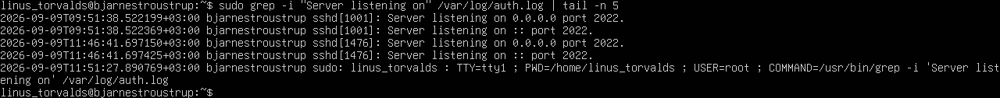
#Задание 15
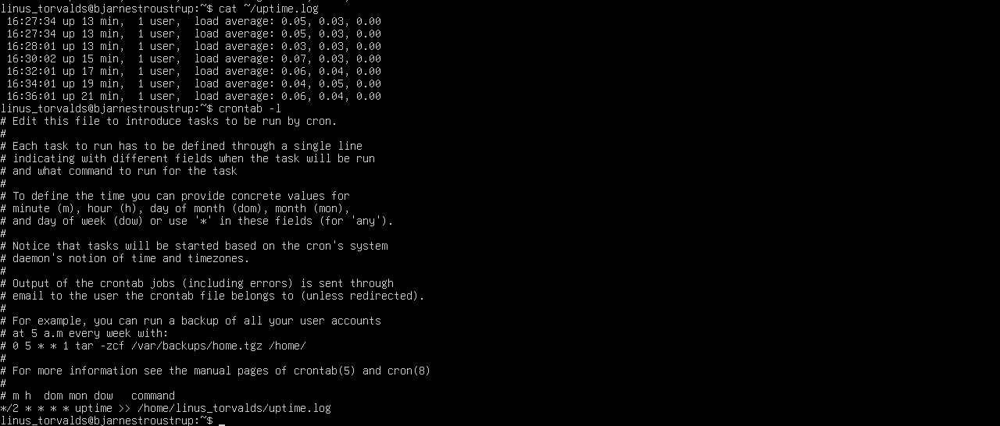
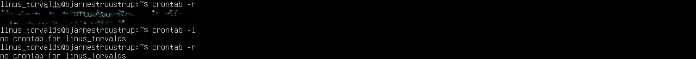